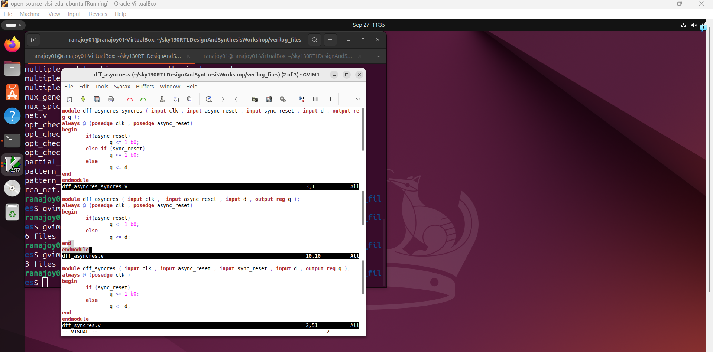

# Level-2(Day-2): Timing libraries,hierarchial vs flat synthesis, efficient flip-flop coding styles

## List of Objectives

- :dart: <b>Practiccal Objective-1:</b> [Lab for introduction to timing.lib]()
   - :microscope: <b>Lab-1:</b> [Clone SKY130 open source process design kit(PDK) on Ubuntu VM as test file library]()
   - :microscope: <b>Lab-2:</b> [ Simulate a RTL design using iverilog]()
   - :microscope: <b>Lab-3:</b> [ Read and edit (editing process only) verilog file using text editor]()
- :dart: <b>Practical Objective-3:</b> [Labs on Hierarchial and Flat synthesis)
    - :microscope: <b>Lab-4:</b> [Synthesize a design using Yosys and SKY130 PDK (Test design: 2:1 MUX (Verilog file named as "good_mux.v"))]()     
- :book: <b>Learning Objective-1:</b> [Various flip-flop coding practices]()
- :dart: <b>Practical Objective-3:</b> [Labs on flip-flop design,simulation,synthesis and optimization]()
    - :microscope: <b>Lab-5:</b> [Synthesize a design using Yosys and SKY130 PDK (Test design: 2:1 MUX (Verilog file named as "good_mux.v"))]()

 <div align="center">:star::star::star::star::star::star:</div> 
 
## :dart: Lab for introduction to timing.lib
 ### :microscope: Lab-1: Open the library file , significance of the filename.
   
   :zap: Open the `.lib` file using text editor-
     
   ```
   $ gvim sky130_fd_sc_hd__tt_025C_1v80.lib
   ```
   
   
   :zap: Go to the command line mode in gvim text editor by pressing `:` -

   - Syntax off-
   ```
    :syn off
   ```
   - Line numbers-
   ```
    :se nu
   ```
   
   
   :zap: Significance of the filename-

   - Based on process, voltage and temperature variation cell performance changes.
   - The performance of cells in `.lib` file are generalized in certain values of these three parameters.
   - We can observe the parameters in the name of `.lib` file.
   -  For the `sky130_fd_sc_hd__tt_025C_1v80.lib` file-
      - Process: `tt` (Typical pocess).
      - Voltage: `1v80` (1.80 V).
      - Temparature: `025C` (25 degree celcius).
   
  ### :microscope: Lab-2: Observe Cell definition, parameters
  :zap: Cell names can be seen using the following command-
   ```
   /cell+ space key
   :g//
   ```
   

  :zap: Now we can check any cell's line number and go to that cell definition-
  ```
  :
  ```
  
  
  :zap: Analyze the cell parameters-
  
   - There are different leakage power for different input combinations.
   - Area,power,capacitance are also present in the definition.
     
  ### :microscope: Lab-3: Compare area,power of variants of same cell
  :zap: We have opened three different flavours of same cell using line number-
  ```
  :36663
  :vsp
  :vsp
  :36904
  :37145
  ```
  
  
   :zap: Compare three cells-

   - `and2_0`,`and2_1`,`and2_2` cells are opened.
   - Area is increasing from `and2_0` to`and2_2`.
   - Speed is increasing from `and2_0` to `and2_2`.
   - Power is increasing from `and2_0` to `and2_2`.
     
  <div align="center">:star::star::star::star::star::star:</div> 
 
## :dart: Lab on Hierarchial vs Flatten synthesis
 ### :microscope: Lab-1: Hierarchial synthesis
   
  :zap: Synthesize `multiple_modules.v` as hierarchial-
     
   ```
  $ read_liberty -lib ../lib/sky130_fd_sc_hd__tt_025C_1v80.lib
  $ read_verilog multiple_modules.v
  $ synth -top multiple_modules
  ```
  
  
  ```
  $ abc -liberty ../lib/sky130_fd_sc_hd__tt_025C_1v80.lib
  $ show
  ```
  

  ```
  $ write_verilog multiple_modules_net.v 
  ```

   
   
   ### :microscope: Lab-2: Flat synthesis
   
  :zap: Synthesize `multiple_modules.v` as flatten-
     
   ```
  $ read_liberty -lib ../lib/sky130_fd_sc_hd__tt_025C_1v80.lib
  $ read_verilog multiple_modules.v
  $ synth -top multiple_modules
  $ abc -liberty ../lib/sky130_fd_sc_hd__tt_025C_1v80.lib
  $ flatten
  $ show
  ```
  

  ```
  $ write_verilog multiple_modules_flat.v 
  ```

   
   
 
  ### :microscope: Lab-3: Compare hierarchical and flat synthesis
  :zap: Hierarchial vs Flat netlist
   ```
   $ gvim multiple_modules_hier.v
   :vsp
   :sp multiple_modules_flat.v
   :exit
   ```
   

  :bulb: Significance of `synth -top`-

  - If a submodule is instantiated multiple times the multiple time synthesis of same submodule is problematic.
  - We can synthesize submodule one time and use this multiple time.
  - This is the significance of `synth -top`-
    
    ```
    synth -top `submodule_name`
    ```
 ### :microscope: Lab-3: Compare area,power of variants of same cell
  :zap: We have opened three different flavours of same cell using line number-
  ```
  :36663
  :vsp
  :vsp
  :36904
  :37145
  ```
  
  
   :zap: Compare three cells-

   - `and2_0`,`and2_1`,`and2_2` cells are opened.
   - Area is increasing from `and2_0` to`and2_2`.
   - Speed is increasing from `and2_0` to `and2_2`.
   - Power is increasing from `and2_0` to `and2_2`.
  

 <div align="center">:star::star::star::star::star::star:</div>   
  
## :dart: Labs on flip-flop design,simulation,synthesis and optimization
 ### :microscope: Lab-4: Analyze different flip-flop designs 
   
   :zap: Open different D flip-flop reset type designs -
   ```
   $ gvim dff*syn*s.v -o
   ```
   
   :zap: Start yosys-
   ```
   $ yosys
   ```
   

   :zap: Give the `.lib` file to yosys for checking the availavle cells-
   ```
   $ read_liberty -lib ../lib/sky130_fd_sc_hd__tt_025C_1v80.lib
   ```
   
   
   :zap: Give the `.v` file `good_mux.v` to yosys for reading the design-
   ```
   $ read_verilog good_mux.v
   ```
   
   
   :zap: Specify the module `good_mux` which to be synthesized as root design-
   ```
   $ synth -top good_mux
   ```
   
   
   :zap: Generate the netlist for the design using the standard cell library-
   ```
   $ abc -liberty ../lib/sky130_fd_sc_hd__tt_025C_1v80.lib
   ```
   

   :zap: Visualize the synthesized design-
   ```
   $ show
   ```
   

   :zap: Write the netlist as `.v` file `good_mux_net.v` with or without attribute (use only one)-
   ```
   $ write_verilog good_mux_net.v
   $ write_verilog -noattr good_mux_net.v
   ```
   
   
   :zap: Read the netlist-
   ```
   $ !gvim good_mux_net.v
   ```
   

   <div align="center">:star::star::star::star::star::star:</div> 
   
## :trophy: Level Status: 

- All objectives completed.
- I have learned simulation using iverilog,GTKWave (for timing diagram viewing) and synthesis using Yosys and SKY130 PDK.
- 🔓 Next level unlocked 🔜 [Level-2(Day-2): Timing libraries,hierarchial vs flat synthesis, efficient flip-flop coding styles](../Level_3/readme.md).


