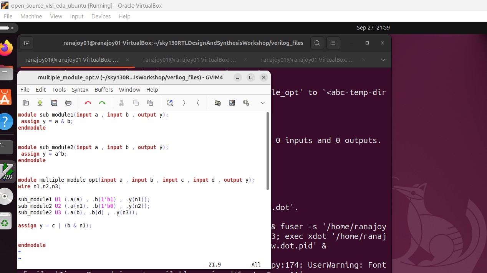
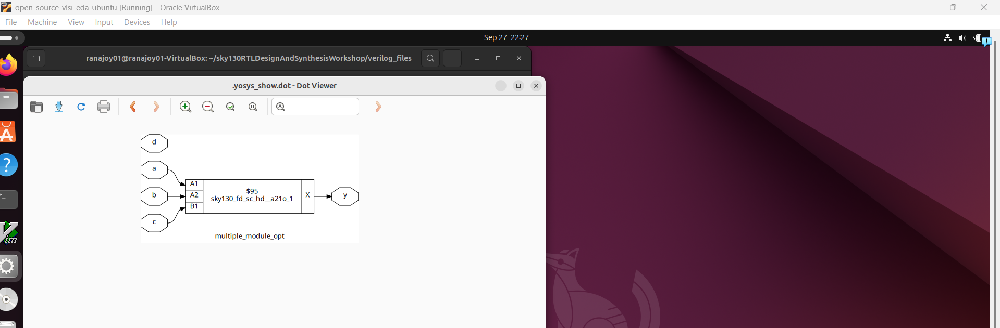
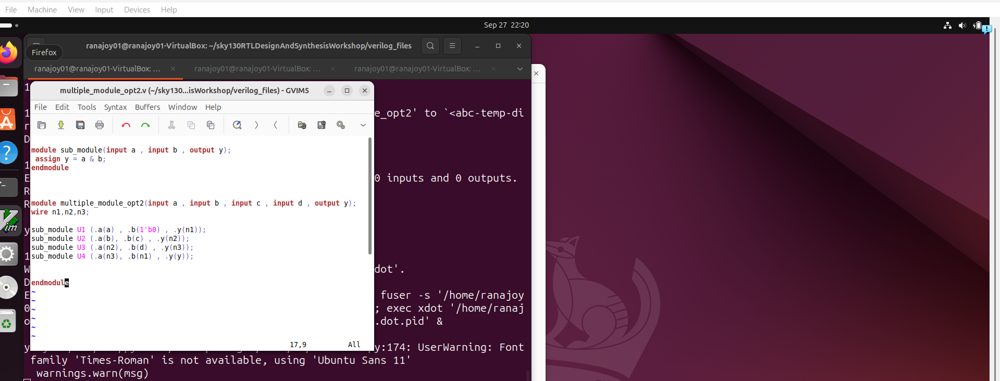
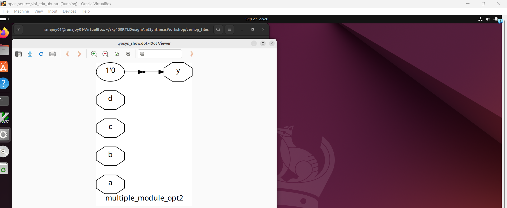

# Level-3(Day-3): Combinational and sequential optimization

## List of Objectives

- :dart: <b>Practiccal Objective-1:</b> [Lab on Combinational logic optimization](#dart-lab-on-combinational-logic-optimization
)
   - :microscope: <b>Lab-1:</b> [Observe and synthesize `opt*.v` files and observe optimization](#microscope-lab-1-observe-and-synthesize-optv-files-and-observe-optimization
)
- :dart: <b>Practical Objective-3:</b> [Lab on Sequential logic optimization (`Sequential constant`)](#dart-lab-on-sequential-logic-optimization-sequential-constant
)
    - :microscope: <b>Lab-2:</b> [Observe the designs `dff_cons*.v`](#microscope-lab-2-observe-the-designs-dff_consv
)
    - :microscope: <b>Lab-3:</b> [Simulate the designs `dff_cons*.v`](#microscope-lab-3-simulate-the-designs-dff_consv
)
    - :microscope: <b>Lab-4:</b> [Synthesize the designs `dff_cons*.v` and observe optimizations](#microscope-lab-4-synthesize-the-designs-dff_consv-and-observe-optimizations
)
 
- :dart: <b>Practical Objective-3:</b> [Lab on Sequential logic optimization (`Sequential unused output`)](#dart-lab-on-sequential-logic-optimization-sequential-unused-output
)
    - :microscope: <b>Lab-5:</b> [Observe the designs `counter_opt*.v`](#microscope-lab-5-observe-the-designs-counter_optv
)
    - :microscope: <b>Lab-6:</b> [Synthesize the designs `counter_opt*.v` and observe optimizations](#microscope-lab-6-synthesize-the-designs-counter_optv-and-observe-optimizations
)
      
 <div align="center">:star::star::star::star::star::star:</div> 
 
## :dart: Lab on Combinational logic optimization
 ### :microscope: Lab-1: Observe and synthesize the combinational logic designs and observe optimization
   
   :zap: Open the `opt*.v` files using text editor-
     
   ```
   $ gvim opt*.v
   ```
   

   :bulb: Each design is written in the behavioural manner of mux.
   
   :zap: Synthesize `opt_check.v` design-

   ```
   $ yosys
   $ read_liberty -lib ../lib/sky130_fd_sc_hd__tt_025C_1v80.lib
   $ read_verilog opt_check.v
   $ synth -top opt_check
   $ abc -liberty ../lib/sky130_fd_sc_hd__tt_025C_1v80.lib
   $ show
   ```
   

   :bulb: The design is optimized to an `and` gate.

   :zap: Synthesize `opt_check2.v` design-

   ```
   $ yosys
   $ read_liberty -lib ../lib/sky130_fd_sc_hd__tt_025C_1v80.lib
   $ read_verilog opt_check2.v
   $ synth -top opt_check2
   $ abc -liberty ../lib/sky130_fd_sc_hd__tt_025C_1v80.lib
   $ show
   ```
   

   :bulb: The design is optimized to an `or` gate.

   :zap: Synthesize `opt_check3.v` design-

   ```
   $ yosys
   $ read_liberty -lib ../lib/sky130_fd_sc_hd__tt_025C_1v80.lib
   $ read_verilog opt_check3.v
   $ synth -top opt_check3
   $ opt_clean -purge
   $ abc -liberty ../lib/sky130_fd_sc_hd__tt_025C_1v80.lib
   $ show
   ```
   

   :bulb: The design is optimized to an `3 input and` gate.

   :zap: Synthesize `opt_check4.v` design-

   ```
   $ yosys
   $ read_liberty -lib ../lib/sky130_fd_sc_hd__tt_025C_1v80.lib
   $ read_verilog opt_check4.v
   $ synth -top opt_check4
   $ opt_clean -purge
   $ abc -liberty ../lib/sky130_fd_sc_hd__tt_025C_1v80.lib
   $ show
   ```
   

   :bulb: The design is optimized to an `2 input xnor` gate and `b` input not used.

---

  :zap: Open the `multiple_module_opt.v` file using text editor-
     
   ```
   $ gvim multiple_module_opt.v
   ```
   

   
   :zap: Synthesize `multiple_module_opt.v` design-

   ```
   $ yosys
   $ read_liberty -lib ../lib/sky130_fd_sc_hd__tt_025C_1v80.lib
   $ read_verilog multiple_module_opt.v
   $ synth -top multiple_module_opt
   $ flatten
   $ opt
   $ opt_reduce
   $ opt_merge
   $ opt_share
   $ opt_clean -purge
   $ abc -liberty ../lib/sky130_fd_sc_hd__tt_025C_1v80.lib
   $ show
   ```
   

   :bulb: The design is optimized to an `a21o1` gate.

---

  :zap: Open the `multiple_module_opt2.v` file using text editor-
     
   ```
   $ gvim multiple_module_opt2.v
   ```
   


   
   :zap: Synthesize `multiple_module_opt2.v` design-

   ```
   $ yosys
   $ read_liberty -lib ../lib/sky130_fd_sc_hd__tt_025C_1v80.lib
   $ read_verilog multiple_module_opt2.v
   $ synth -top multiple_module_opt2
   $ flatten
   $ opt
   $ opt_reduce
   $ opt_merge
   $ opt_share
   $ opt_clean -purge
   $ abc -liberty ../lib/sky130_fd_sc_hd__tt_025C_1v80.lib
   $ show
   ```
   

   :bulb: The design is optimized to ground `1'b0` connection to output.

   
     
  <div align="center">:star::star::star::star::star::star:</div> 
 
## :dart: Lab on Sequential logic optimization (`Sequential constant`)
 ### :microscope: Lab-2: Observe the designs `dff_cons*.v`
   
  :zap: Open the designs `dff_cons*.v` using text editor-
  
   ```
   $ gvim dff_cons*.v
   ```
   
   
   :bulb: Here we have to find the `sequential constant` cases.
   ### :microscope: Lab-3: Simulate the designs `dff_cons*.v`
   
  :zap: Simulate design `dff_const1.v` using iverilog-
     
   ```
  $ iverilog dff_const1.v tb_dff_const1.v
  $ ./a.out
  $ gtkwave tb_dff_const1.vcd
  ```
  

  :bulb: Output `q` is changing. It is not an example of sequential constant.

  :zap: Simulate design `dff_const2.v` using iverilog-
     
   ```
  $ iverilog dff_const2.v tb_dff_const2.v
  $ ./a.out
  $ gtkwave tb_dff_const2.vcd
  ```
  

  :bulb: Output `q` is not changing. It is an example of sequential constant.

  :zap: Simulate design `dff_const3.v` using iverilog-
     
   ```
  $ iverilog dff_const3.v tb_dff_const3.v
  $ ./a.out
  $ gtkwave tb_dff_const3.vcd
  ```
  

  :bulb: Output `q` is changing. It is not an example of sequential constant.

  :zap: Simulate design `dff_const4.v` using iverilog-
     
   ```
  $ iverilog dff_const4.v tb_dff_const4.v
  $ ./a.out
  $ gtkwave tb_dff_const4.vcd
  ```
  

  :bulb: Output `q` is not changing. It is an example of sequential constant.

  :zap: Simulate design `dff_const5.v` using iverilog-
     
   ```
  $ iverilog dff_const5.v tb_dff_const5.v
  $ ./a.out
  $ gtkwave tb_dff_const5.vcd
  ```
  

  :bulb: Output `q` is changing. It is not an example of sequential constant.

  ### :microscope: Lab-4: Synthesize the designs `dff_cons*.v` and observe optimizations
  
  :zap: Synthesize the design `dff_cont1.v` using Yosys and SKY130 PDK-
  
  ```
  $ yosys
  $ read_liberty -lib ../lib/sky130_fd_sc_hd__tt_025C_1v80.lib
  $ read_verilog dff_const1.v
  $ synth -top dff_const1
  $ dfflibmap -liberty ../lib/sky130_fd_sc_hd__tt_025C_1v80.lib
  $ abc -liberty ../lib/sky130_fd_sc_hd__tt_025C_1v80.lib
  $ show

  ```

  
  
  :bulb: Here an asynchronous reset D flip-flop is generated with input `d` always `1'b1'.
  
  :bulb: It is not an example of `sequential constant` optimization.

  ---
  :zap: Synthesize the design `dff_cont2.v` using Yosys and SKY130 PDK-
  
  ```
  $ yosys
  $ read_liberty -lib ../lib/sky130_fd_sc_hd__tt_025C_1v80.lib
  $ read_verilog dff_const2.v
  $ synth -top dff_const2
  $ dfflibmap -liberty ../lib/sky130_fd_sc_hd__tt_025C_1v80.lib
  $ abc -liberty ../lib/sky130_fd_sc_hd__tt_025C_1v80.lib
  $ show

  ```

  
  
  :bulb: Here an asynchronous reset D flip-flop is generated with input `d` always `1'b0'.
  
  :bulb: It is an example of `sequential constant` optimization.

  ---
  :zap: Synthesize the design `dff_cont3.v` using Yosys and SKY130 PDK-
  
  ```
  $ yosys
  $ read_liberty -lib ../lib/sky130_fd_sc_hd__tt_025C_1v80.lib
  $ read_verilog dff_const3.v
  $ synth -top dff_const3
  $ dfflibmap -liberty ../lib/sky130_fd_sc_hd__tt_025C_1v80.lib
  $ abc -liberty ../lib/sky130_fd_sc_hd__tt_025C_1v80.lib
  $ show

  ```

  
  
  :bulb: Here one asynchronous reset D flip-flop and one asynchronous set D flip-flop are generated.
  
  :bulb: It is not an example of `sequential constant` optimization.

  ---
  :zap: Synthesize the design `dff_cont4.v` using Yosys and SKY130 PDK-
  
  ```
  $ yosys
  $ read_liberty -lib ../lib/sky130_fd_sc_hd__tt_025C_1v80.lib
  $ read_verilog dff_const4.v
  $ synth -top dff_const4
  $ dfflibmap -liberty ../lib/sky130_fd_sc_hd__tt_025C_1v80.lib
  $ abc -liberty ../lib/sky130_fd_sc_hd__tt_025C_1v80.lib
  $ show

  ```

  
  
  
  :bulb: It is an example of `sequential constant` optimization.

  ---
  :zap: Synthesize the design `dff_cont5.v` using Yosys and SKY130 PDK-
  
  ```
  $ yosys
  $ read_liberty -lib ../lib/sky130_fd_sc_hd__tt_025C_1v80.lib
  $ read_verilog dff_const5.v
  $ synth -top dff_const5
  $ dfflibmap -liberty ../lib/sky130_fd_sc_hd__tt_025C_1v80.lib
  $ abc -liberty ../lib/sky130_fd_sc_hd__tt_025C_1v80.lib
  $ show

  ```

  
  
  :bulb: Here two asynchronous reset D flip-flop are generated with input `d` always `1'b1'.
  
  :bulb: It is not an example of `sequential constant` optimization.

  ---

 ## :dart: Lab on Sequential logic optimization (`Sequential unused output`)
 ### :microscope: Lab-5: Observe the designs `counter_opt*.v`
   
  :zap: Open the designs `dff_cons*.v` using text editor-
  
   ```
   $ gvim counter_opt*.v
   ```
   
   
   :bulb: Here we have to find the `sequential unused output` cases.
 
  ### :microscope: Lab-6: Synthesize the designs `counter_opt*.v` and observe optimizations
  
  :zap: Synthesize the design `counter_opt.v` using Yosys and SKY130 PDK-
  
  ```
  $ yosys
  $ read_liberty -lib ../lib/sky130_fd_sc_hd__tt_025C_1v80.lib
  $ read_verilog counter_opt.v
  $ synth -top counter_opt
  $ dfflibmap -liberty ../lib/sky130_fd_sc_hd__tt_025C_1v80.lib
  $ abc -liberty ../lib/sky130_fd_sc_hd__tt_025C_1v80.lib
  $ show

  ```

  
  
  :bulb: Here only one D flipflop generated for `LSB` bit of counter as other two bits of counter are not used for output.
  
  :bulb: It is an example of `sequential unused ouput` optimization.

  ---
:zap: Synthesize the design `counter_opt2.v` using Yosys and SKY130 PDK-
  
  ```
  $ yosys
  $ read_liberty -lib ../lib/sky130_fd_sc_hd__tt_025C_1v80.lib
  $ read_verilog counter_opt2.v
  $ synth -top counter_opt2
  $ dfflibmap -liberty ../lib/sky130_fd_sc_hd__tt_025C_1v80.lib
  $ abc -liberty ../lib/sky130_fd_sc_hd__tt_025C_1v80.lib
  $ show

  ```

  
  
  :bulb: Here three D flipflop generated for as three bits of counter are used for output.
  
  :bulb: It is not an example of `sequential unused ouput` optimization.

  ---
 
   <div align="center">:star::star::star::star::star::star:</div> 
   
## :trophy: Level Status: 

- All objectives completed.
- I have learned about different combinational and sequential logic optimization during synthesis.
- 🔓 Next level unlocked 🔜 [Level-4(Day-4): Gate level simulation,blocking vs non-blocking statement,synthesis-simulation mismatch](../Level_4/readme.md).


