# Level-3(Day-3): Combinational and sequential optimization

## List of Objectives

- :dart: <b>Practiccal Objective-1:</b> [Lab on Combinational logic optimization]()
   - :microscope: <b>Lab-1:</b> [Observe and synthesize `opt*.v` files and observe optimization]()
    

- :dart: <b>Practical Objective-3:</b> []()
    - :microscope: <b>Lab-2:</b> [Observe the designs `dff_cons*.v`]()
    - :microscope: <b>Lab-3:</b> [Simulate the designs `dff_cons*.v`]()
    - :microscope: <b>Lab-4:</b> [Synthesize the designs `dff_cons*.v` and observe optimizations]()

    - :microscope: <b>Lab-6:</b> []()
 
- :dart: <b>Practical Objective-3:</b> []()
    - :microscope: <b>Lab-7:</b> []()
    - :microscope: <b>Lab-8:</b> []()
    - :microscope: <b>Lab-8:</b> []()
    - :microscope: <b>Lab-8:</b> []()

 <div align="center">:star::star::star::star::star::star:</div> 
 
## :dart: Lab on Combinational logic optimization
 ### :microscope: Lab-1: Observe and synthesize `opt*.v` files and observe optimization
   
   :zap: Open the `opt*.v` files using text editor-
     
   ```
   $ gvim opt*.v
   ```
   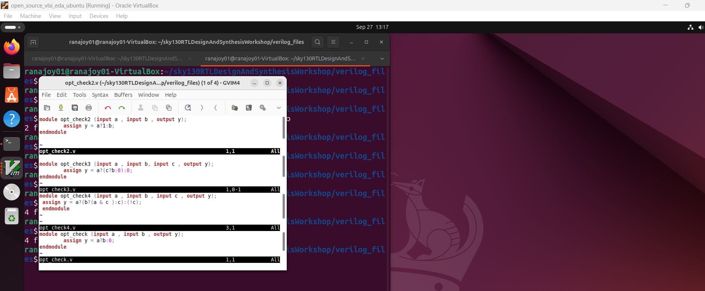

   :bulb: Each design is written in the behavioural manner of mux.
   
   :zap: Synthesize `opt_check.v` design-

   ```
   $ yosys
   $ read_liberty -lib ../lib/sky130_fd_sc_hd__tt_025C_1v80.lib
   $ read_verilog opt_check.v
   $ synth -top opt_check
   $ abc -liberty ../lib/sky130_fd_sc_hd__tt_025C_1v80.lib
   $ show
   ```
   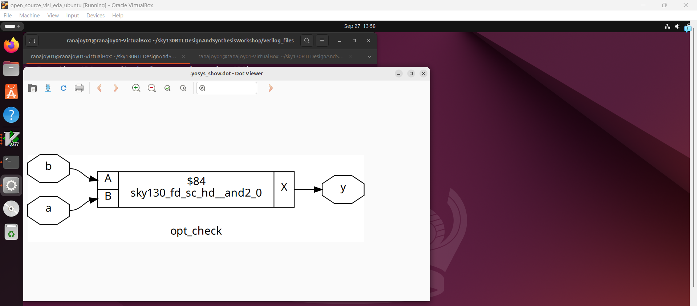

   :bulb: The design is optimized to an `and` gate.

   :zap: Synthesize `opt_check2.v` design-

   ```
   $ yosys
   $ read_liberty -lib ../lib/sky130_fd_sc_hd__tt_025C_1v80.lib
   $ read_verilog opt_check2.v
   $ synth -top opt_check2
   $ abc -liberty ../lib/sky130_fd_sc_hd__tt_025C_1v80.lib
   $ show
   ```
   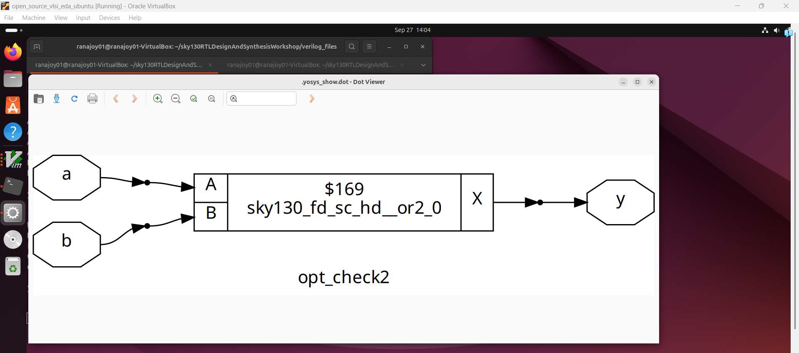

   :bulb: The design is optimized to an `or` gate.

   :zap: Synthesize `opt_check3.v` design-

   ```
   $ yosys
   $ read_liberty -lib ../lib/sky130_fd_sc_hd__tt_025C_1v80.lib
   $ read_verilog opt_check3.v
   $ synth -top opt_check3
   $ opt_clean -purge
   $ abc -liberty ../lib/sky130_fd_sc_hd__tt_025C_1v80.lib
   $ show
   ```
   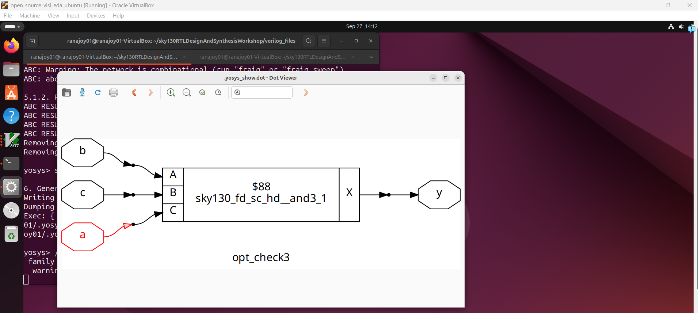

   :bulb: The design is optimized to an `3 input and` gate.

   :zap: Synthesize `opt_check4.v` design-

   ```
   $ yosys
   $ read_liberty -lib ../lib/sky130_fd_sc_hd__tt_025C_1v80.lib
   $ read_verilog opt_check4.v
   $ synth -top opt_check4
   $ opt_clean -purge
   $ abc -liberty ../lib/sky130_fd_sc_hd__tt_025C_1v80.lib
   $ show
   ```
   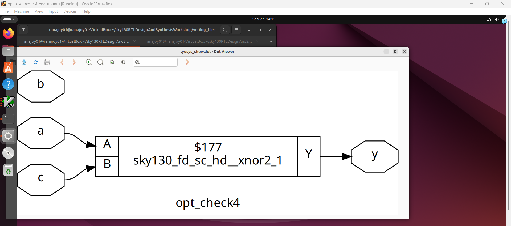

   :bulb: The design is optimized to an `2 input xnor` gate and `b` input not used.
   
   
     
  <div align="center">:star::star::star::star::star::star:</div> 
 
## :dart: Lab on Sequential logic optimization (`Sequential constant`)
 ### :microscope: Lab-2: Observe the designs `dff_cons*.v`
   
  :zap: Open the designs `dff_cons*.v` using text editor-
  
   ```
   $ gvim dff_cons*.v
   ```
   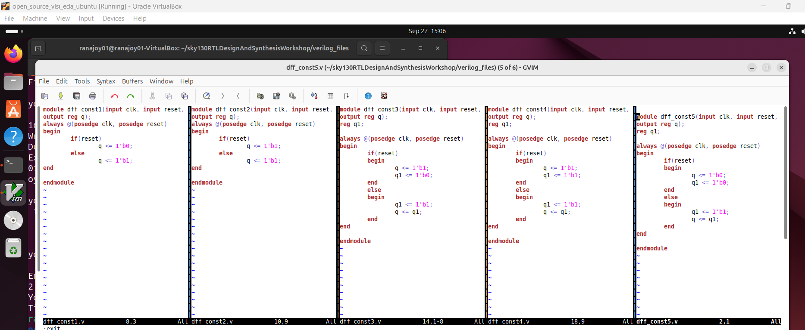
   
   :bulb: Here we have to find the `sequential constant` cases.
   ### :microscope: Lab-3: Simulate the designs `dff_cons*.v`
   
  :zap: Simulate design `dff_const1.v` using iverilog-
     
   ```
  $ iverilog dff_const1.v tb_dff_const1.v
  $ ./a.out
  $ gtkwave tb_dff_const1.vcd
  ```
  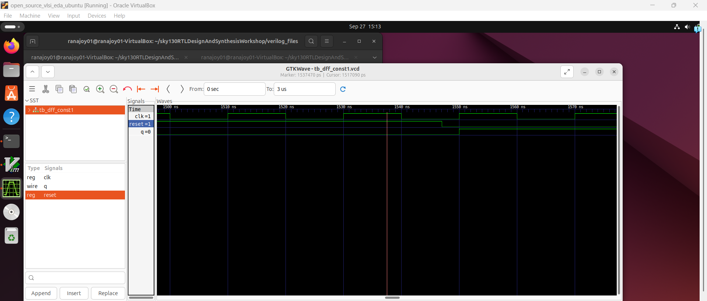

  :bulb: Output `q` is changing. It is not an example of sequential constant.

  :zap: Simulate design `dff_const2.v` using iverilog-
     
   ```
  $ iverilog dff_const2.v tb_dff_const2.v
  $ ./a.out
  $ gtkwave tb_dff_const2.vcd
  ```
  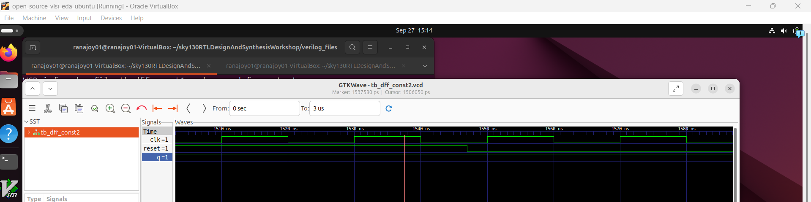

  :bulb: Output `q` is not changing. It is an example of sequential constant.

  :zap: Simulate design `dff_const3.v` using iverilog-
     
   ```
  $ iverilog dff_const3.v tb_dff_const3.v
  $ ./a.out
  $ gtkwave tb_dff_const3.vcd
  ```
  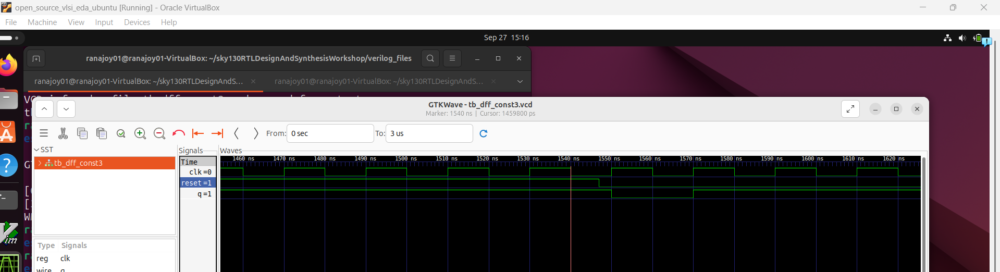

  :bulb: Output `q` is changing. It is not an example of sequential constant.

  :zap: Simulate design `dff_const4.v` using iverilog-
     
   ```
  $ iverilog dff_const4.v tb_dff_const4.v
  $ ./a.out
  $ gtkwave tb_dff_const4.vcd
  ```
  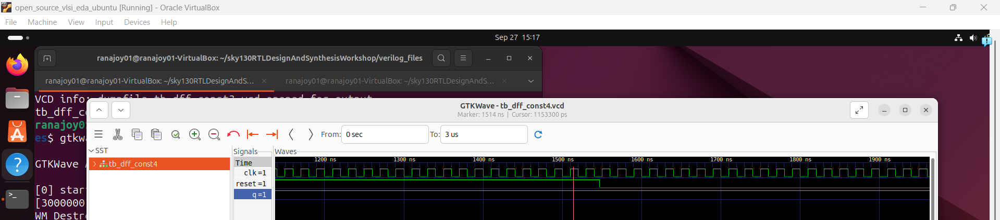

  :bulb: Output `q` is not changing. It is an example of sequential constant.

  :zap: Simulate design `dff_const5.v` using iverilog-
     
   ```
  $ iverilog dff_const5.v tb_dff_const5.v
  $ ./a.out
  $ gtkwave tb_dff_const5.vcd
  ```
  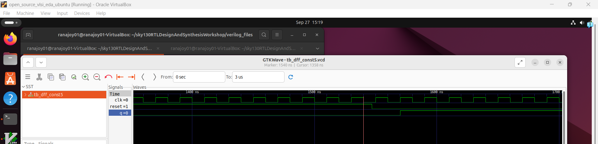

  :bulb: Output `q` is changing. It is not an example of sequential constant.

  ### :microscope: Lab-4: Synthesize the designs `dff_cons*.v` and observe optimizations
  
  :zap: Synthesize the design `dff_cont1.v` using Yosys and SKY130 PDK-
  
  ```
  $ yosys
  $ read_liberty -lib ../lib/sky130_fd_sc_hd__tt_025C_1v80.lib
  $ read_verilog dff_const1.v
  $ synth -top dff_const1
  $ dfflibmap -liberty ../lib/sky130_fd_sc_hd__tt_025C_1v80.lib
  $ abc -liberty ../lib/sky130_fd_sc_hd__tt_025C_1v80.lib
  $ show

  ```

  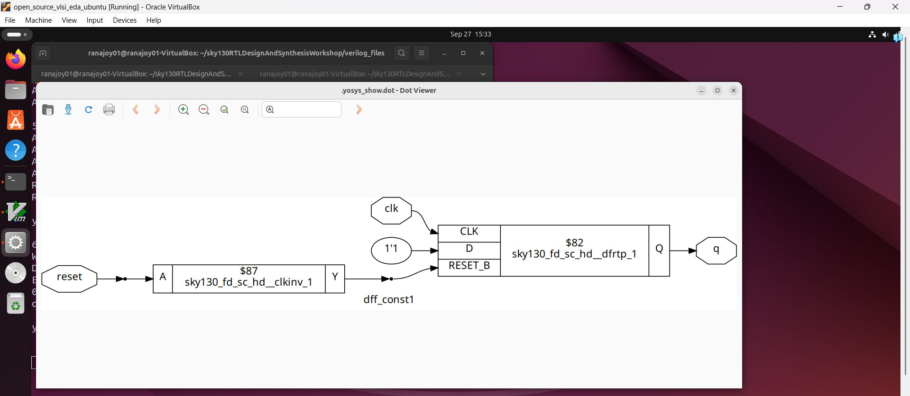
  
  :bulb: Here an asynchronous reset D flip-flop is generated with input `d` always `1'b1'.
  
  :bulb: It is not an example of `sequential constant` optimization.

  ---
  :zap: Synthesize the design `dff_cont2.v` using Yosys and SKY130 PDK-
  
  ```
  $ yosys
  $ read_liberty -lib ../lib/sky130_fd_sc_hd__tt_025C_1v80.lib
  $ read_verilog dff_const2.v
  $ synth -top dff_const2
  $ dfflibmap -liberty ../lib/sky130_fd_sc_hd__tt_025C_1v80.lib
  $ abc -liberty ../lib/sky130_fd_sc_hd__tt_025C_1v80.lib
  $ show

  ```

  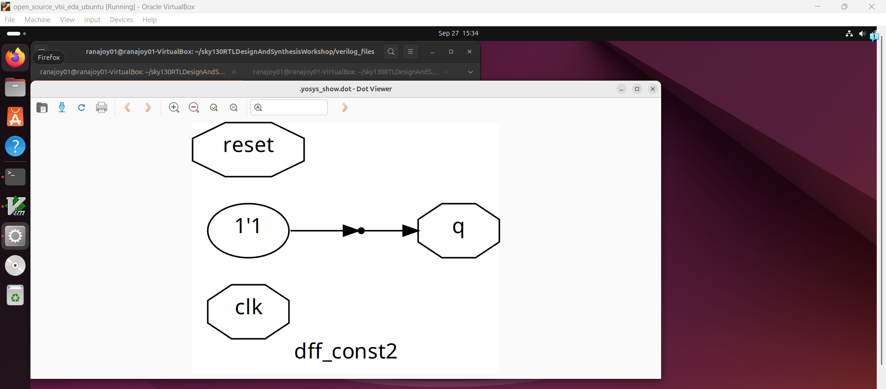
  
  :bulb: Here an asynchronous reset D flip-flop is generated with input `d` always `1'b0'.
  
  :bulb: It is an example of `sequential constant` optimization.

  ---
  :zap: Synthesize the design `dff_cont3.v` using Yosys and SKY130 PDK-
  
  ```
  $ yosys
  $ read_liberty -lib ../lib/sky130_fd_sc_hd__tt_025C_1v80.lib
  $ read_verilog dff_const3.v
  $ synth -top dff_const3
  $ dfflibmap -liberty ../lib/sky130_fd_sc_hd__tt_025C_1v80.lib
  $ abc -liberty ../lib/sky130_fd_sc_hd__tt_025C_1v80.lib
  $ show

  ```

  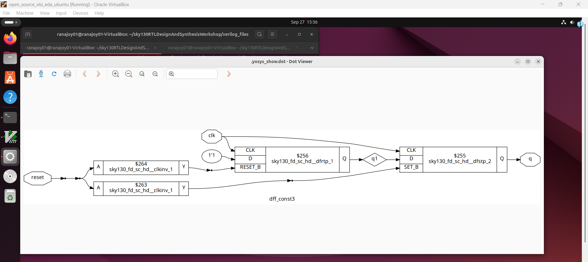
  
  :bulb: Here one asynchronous reset D flip-flop and one asynchronous set D flip-flop are generated.
  
  :bulb: It is not an example of `sequential constant` optimization.

  ---
  :zap: Synthesize the design `dff_cont4.v` using Yosys and SKY130 PDK-
  
  ```
  $ yosys
  $ read_liberty -lib ../lib/sky130_fd_sc_hd__tt_025C_1v80.lib
  $ read_verilog dff_const4.v
  $ synth -top dff_const4
  $ dfflibmap -liberty ../lib/sky130_fd_sc_hd__tt_025C_1v80.lib
  $ abc -liberty ../lib/sky130_fd_sc_hd__tt_025C_1v80.lib
  $ show

  ```

  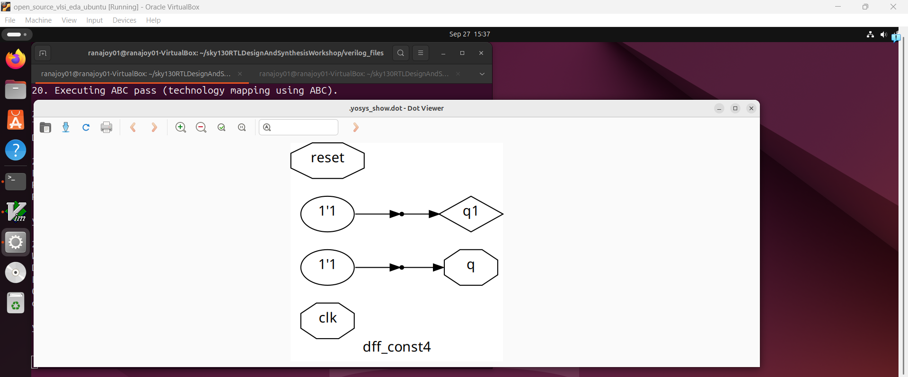
  
  
  :bulb: It is an example of `sequential constant` optimization.

  ---
  :zap: Synthesize the design `dff_cont5.v` using Yosys and SKY130 PDK-
  
  ```
  $ yosys
  $ read_liberty -lib ../lib/sky130_fd_sc_hd__tt_025C_1v80.lib
  $ read_verilog dff_const5.v
  $ synth -top dff_const5
  $ dfflibmap -liberty ../lib/sky130_fd_sc_hd__tt_025C_1v80.lib
  $ abc -liberty ../lib/sky130_fd_sc_hd__tt_025C_1v80.lib
  $ show

  ```

  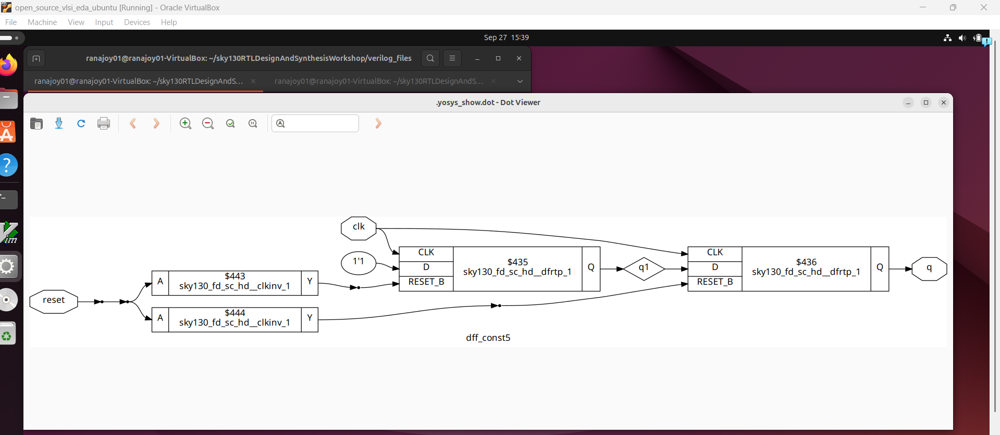
  
  :bulb: Here two asynchronous reset D flip-flop are generated with input `d` always `1'b1'.
  
  :bulb: It is not an example of `sequential constant` optimization.

  ---

 ## :dart: Lab on Sequential logic optimization (`Sequential unused output`)
 ### :microscope: Lab-5: Observe the designs `counter_opt*.v`
   
  :zap: Open the designs `dff_cons*.v` using text editor-
  
   ```
   $ gvim counter_opt*.v
   ```
   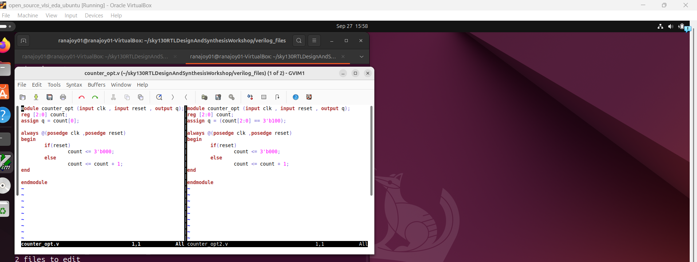
   
   :bulb: Here we have to find the `sequential unused output` cases.
 
  ### :microscope: Lab-6: Synthesize the designs `counter_opt*.v` and observe optimizations
  
  :zap: Synthesize the design `counter_opt.v` using Yosys and SKY130 PDK-
  
  ```
  $ yosys
  $ read_liberty -lib ../lib/sky130_fd_sc_hd__tt_025C_1v80.lib
  $ read_verilog counter_opt.v
  $ synth -top counter_opt
  $ dfflibmap -liberty ../lib/sky130_fd_sc_hd__tt_025C_1v80.lib
  $ abc -liberty ../lib/sky130_fd_sc_hd__tt_025C_1v80.lib
  $ show

  ```

  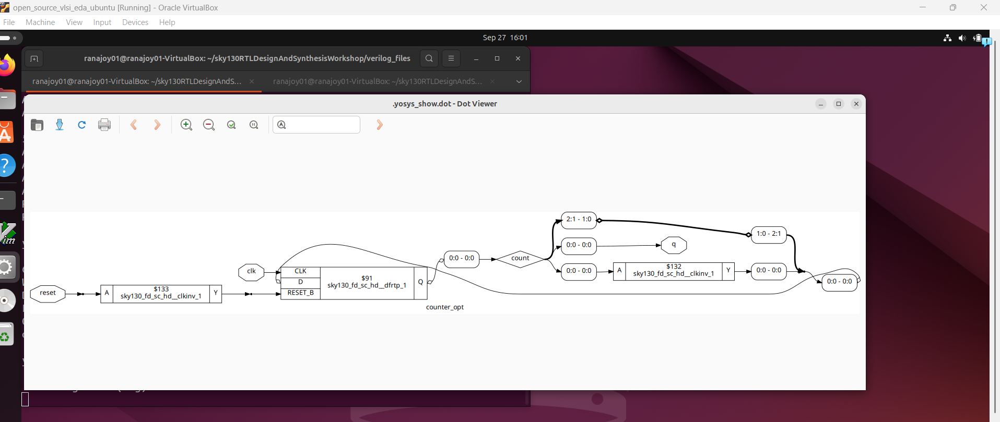
  
  :bulb: Here only one D flipflop generated for `LSB` bit of counter as other two bits of counter are not used for output.
  
  :bulb: It is an example of `sequential unused ouput` optimization.

  ---
:zap: Synthesize the design `counter_opt2.v` using Yosys and SKY130 PDK-
  
  ```
  $ yosys
  $ read_liberty -lib ../lib/sky130_fd_sc_hd__tt_025C_1v80.lib
  $ read_verilog counter_opt2.v
  $ synth -top counter_opt2
  $ dfflibmap -liberty ../lib/sky130_fd_sc_hd__tt_025C_1v80.lib
  $ abc -liberty ../lib/sky130_fd_sc_hd__tt_025C_1v80.lib
  $ show

  ```

  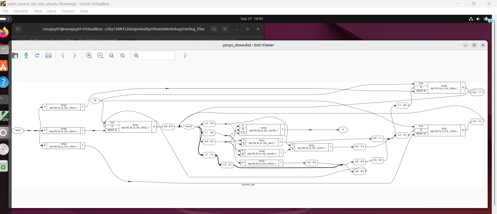
  
  :bulb: Here three D flipflop generated for as three bits of counter are used for output.
  
  :bulb: It is not an example of `sequential unused ouput` optimization.

  ---
 
  ### :microscope: Lab-6: Compare hierarchical and flat synthesis
  :zap: Hierarchial vs Flat netlist
   ```
   $ gvim multiple_modules_hier.v
   :vsp
   :sp multiple_modules_flat.v
   :exit
   ```
   

  :bulb: Significance of `synth -top`-

  - If a submodule is instantiated multiple times the multiple time synthesis of same submodule is problematic.
  - We can synthesize submodule one time and use this multiple time.
  - This is the significance of `synth -top`-
    
    ```
    synth -top `submodule_name`
    ```

 <div align="center">:star::star::star::star::star::star:</div>   
  
## :dart: Labs on flip-flop design,simulation,synthesis and optimization
 ### :microscope: Lab-7: Analyze different flip-flop designs 
 
   :zap: Open different D flip-flop reset type designs -
   ```
   $ gvim dff*syn*s.v -o
   ```
   
   
   :zap: Analysis of reset type flip-flop verilog code-

   - D-flipflops ,so `posedge clk` in sensitivity list.
   - When asynchronous reset high then, output of D flip-flop is set to zero immediately,no change on `clk` edge.
   - When synchronous reset high then, output of D flip-flop is set to zero on next positive `clk` edge.
   - For asynchronous reset `posedge reset` in sensitivity list also.
   - For synchronous reset `posedge clk` in sensitivity list only.
   - Non-blocking assignments are used inside `always` block.
     
  :zap: Open different D flip-flop reset type designs -
   ```
   $ gvim dff_async_set.v
   ```
        
     
   
   :zap: Analysis of reset type flip-flop verilog code-

   - D-flipflops ,so `posedge clk` in sensitivity list.
   - For asynchronous reset `posedge reset` in sensitivity list also.
   - When asynchronous eset high then, output of D flip-flop is set to one immediately,no change on `clk` edge.
   - 
### :microscope: Lab-8: Simulate different flip-flop designs 
:zap: Simulate `dff_asyncres.v` using iverilog-

```
$ iverilog dff_asyncres.v tb_dff_asyncres.v
$ ./a.out
$ gtkwave tb_dff_asyncres.vcd
```


:zap: Simulate `dff_syncres.v` using iverilog-

```
$ iverilog dff_syncres.v tb_dff_syncres.v
$ ./a.out
$ gtkwave tb_dff_syncres.vcd
```


:zap: Simulate `dff_async_set.v` using iverilog-

```
$ iverilog dff_async_set.v tb_dff_async_set.v
$ ./a.out
$ gtkwave tb_dff_async_set.vcd
```


### :microscope: Lab-9: Synthesize different flip-flop designs   
:zap: Synthesize `dff_asyncres.v` using Yosys and SKY130 PDK-

```
$ yosys
$ read_liberty -lib ../lib/sky130_fd_sc_hd__tt_025C_1v80.lib
$ read_verilog dff_asyncres.v
$ synth -top dff_asyncres
```


```
$ dfflibmap -liberty ../lib/sky130_fd_sc_hd__tt_025C_1v80.lib
```


```
$ abc -liberty ../lib/sky130_fd_sc_hd__tt_025C_1v80.lib
$ show
```


```
$ write_verilog -noattr dff_asyncres_net.v
$ !gvim dff_asyncres_net.v
```


:zap: Synthesize `dff_syncres.v` using Yosys and SKY130 PDK-

```
$ yosys
$ read_liberty -lib ../lib/sky130_fd_sc_hd__tt_025C_1v80.lib
$ read_verilog dff_syncres.v
$ synth -top dff_syncres
$ dfflibmap -liberty ../lib/sky130_fd_sc_hd__tt_025C_1v80.lib
$ abc -liberty ../lib/sky130_fd_sc_hd__tt_025C_1v80.lib
$ show
```


```
$ write_verilog -noattr dff_syncres_net.v
$ !gvim dff_syncres_net.v
```


:zap: Synthesize `dff_async_set.v` using Yosys and SKY130 PDK-

```
$ yosys
$ read_liberty -lib ../lib/sky130_fd_sc_hd__tt_025C_1v80.lib
$ read_verilog dff_async_set.v
$ synth -top dff_async_set
$ dfflibmap -liberty ../lib/sky130_fd_sc_hd__tt_025C_1v80.lib
$ abc -liberty ../lib/sky130_fd_sc_hd__tt_025C_1v80.lib
$ show
```


```
$ write_verilog -noattr dff_async_set_net.v
$ !gvim dff_async_set_net.v
```


### :microscope: Lab-10: Interesting synthesis optimization (No haedware block generate)
:zap: `mult_2.v` design -

```
$gvim mult_2.v
```


:zap: Synthesize `mult_2.v` and observe the optimization-

```
$ yosys
$ read_liberty -lib ../lib/sky130_fd_sc_hd__tt_025C_1v80.lib
$ read_verilog mult_2.v
$ synth -top mul2
$ abc -liberty ../lib/sky130_fd_sc_hd__tt_025C_1v80.lib
$ show
```


:bulb: No hardware block generated

:bulb: 3 bit number multipliesd with 2 results 4 bit number first three bits from MSB of result is same as 3 bit number and LSB is zero.

:zap: `mult_8.v` design -

```
$gvim mult_8.v
```


:zap: Synthesize `mult_8.v` and observe the optimization-

```
$ yosys
$ read_liberty -lib ../lib/sky130_fd_sc_hd__tt_025C_1v80.lib
$ read_verilog mult_8.v
$ synth -top mult8
$ abc -liberty ../lib/sky130_fd_sc_hd__tt_025C_1v80.lib
$ show
```


:bulb: No hardware block generated.

:bulb: 3 bit number multipliesd with 9 results 6 bit number where the 3 bit number repeats two times.


   <div align="center">:star::star::star::star::star::star:</div> 
   
## :trophy: Level Status: 

- All objectives completed.
- I have learned about `.lib`, hierarchial vs flat synthesis , flop design, simulation, synthesis and some interseting optimization.
- 🔓 Next level unlocked 🔜 [Level-4(Day-4): Gate level simulation,blocking vs non-blocking statement,synthesis-simulation mismatch](../Level_4/readme.md).


