# Level-4(Day-4): Gate level simulation,blocking vs non-blocking statement,synthesis-simulation mismatch


## List of Objectives

 - :dart: <b>Practiccal Objective-1:</b> [Lab on GLS and `Synthesis-Simulation mismatch`](#dart-lab-on-gls-and-synthesis-simulation-mismatch
)
   - :microscope: <b>Lab-1:</b> [`Missing sensitivity list issue` Functional simulation of RTL design and GLS simulation](#microscope-lab-1missing-sensitivity-list-issue-functional-simulation-of-rtl-design-and-gls-simulation-test-design-ternary_operator_muxv
)
   - :microscope: <b>Lab-2:</b> [`Blocking statement issue` Functional simulation of RTL design and GLS simulation](#microscope-lab-2blocking-statement-issue-functional-simulation-of-rtl-design-and-gls-simulation-test-design-blocking_caveatv)
     
 <div align="center">:star::star::star::star::star::star:</div> 
 
## :dart: Lab on GLS and `Synthesis-Simulation mismatch`
 ### :microscope: Lab-1:`Missing sensitivity list issue` Functional simulation of RTL design and GLS simulation (Test design: `ternary_operator_mux.v` and `bad_mux.v`)
   
   :zap: Open the `ternary_operator_mux.v` file using text editor (For viewing the code not for simulation)-
     
   ```
   $ gvim ternary_operator_mux.v 
   ```
   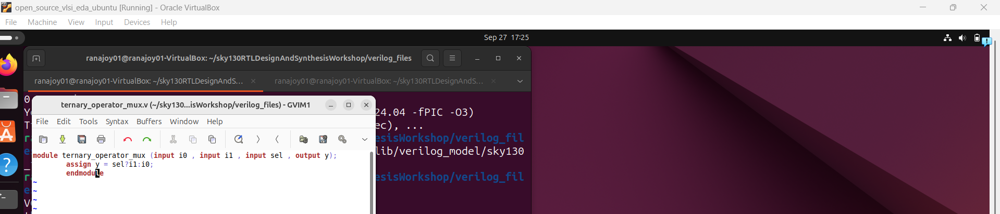

   :bulb: Our aim is MUX, here one approach is shown using ternary operator.
   
   :zap: Simulate `ternary_operator_mux.v`-

   ```
   $ iverilog ternary_operator_mux.v tb_ternary_operator_mux.v
   $ ./a.out
   $ gtkwave tb_ternary_operator_mux.vcd

   ```

   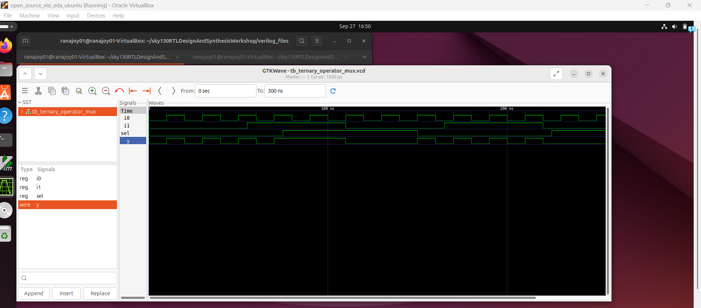

   :bulb: Functional simulation shows that it is acting like a mux.

   :zap: Synthesize `ternary_operator_mux.v` and generate netlist-
   
   ```
   $ yosys
   $ read_liberty -lib ../lib/sky130_fd_sc_hd__tt_025C_1v80.lib
   $ read_verilog ternary_operator_mux.v
   $ synth -top ternary_operator_mux
   $ abc -liberty ../lib/sky130_fd_sc_hd__tt_025C_1v80.lib
   $ show
   ```
   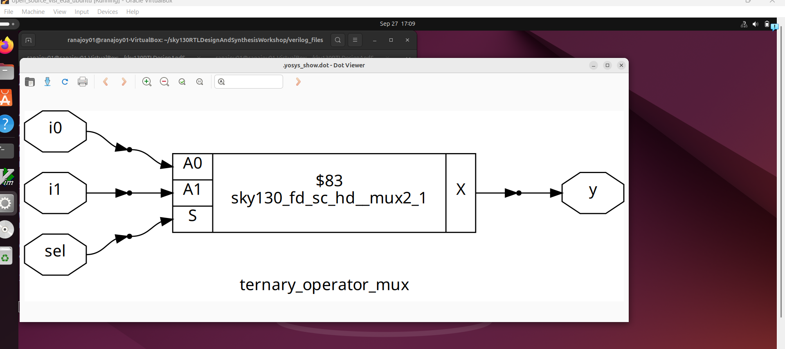

   Generate netlist-
   
   ```
   $ write_verilog -noattr ternary_operator_mux_net.v
   ```

   :bulb: It generated a `mux` cell.

   :zap: Gate level simulation of `ternary_operator_mux.v`
   
   
 Give the netlist `ternary_operator_mux_net.v` ,premitive ,standard cells and the testbench used for RTL design case `tb_ternary_operator_mux.v` to iverilog simulator-
    
   ```
   $ iverilog ../my_lib/verilog_model/primitives.v ../my_lib/verilog_model/sky130_fd_sc_hd.v ternary_operator_mux_net.v tb_ternary_operator_mux.v
   $ ./a.out
   $ gtkwave tb_ternary_operator_mux.vcd

   ```
   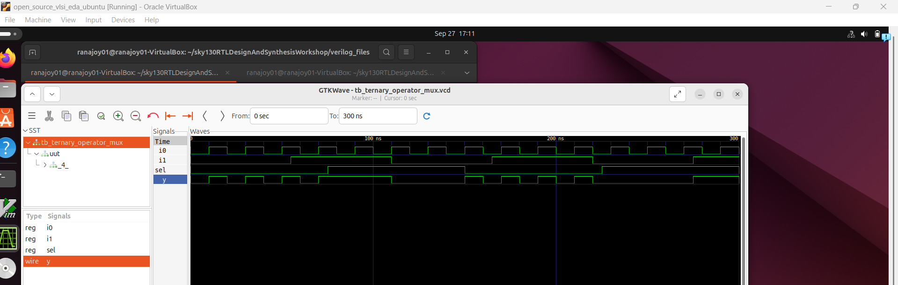

   :white_check_mark: Here is no `Synthesis-simulation` mismatch.

  ---

  :zap: Open the `bad_mux.v` file using text editor (For viewing the code not for simulation)-
     
   ```
   $ gvim bad_mux.v 
   ```
   

   :bulb: Our aim is MUX, here one approach is shown using procedural block.
   
   :zap: Simulate `bad_mux.v`-

   ```
   $ iverilog bad_mux.v tb_bad_mux.v
   $ ./a.out
   $ gtkwave tb_bad_mux.vcd

   ```

   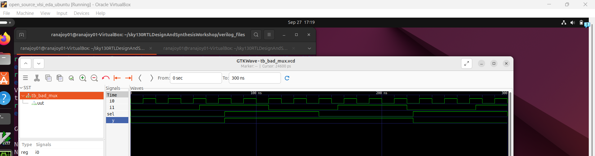

   :bulb: Functional simulation shows that it is not acting like a mux.

   :zap: Synthesize `bad_mux.v` and generate netlist-
   
   ```
   $ yosys
   $ read_liberty -lib ../lib/sky130_fd_sc_hd__tt_025C_1v80.lib
   $ read_verilog bad_mux.v
   $ synth -top bad_mux
   $ abc -liberty ../lib/sky130_fd_sc_hd__tt_025C_1v80.lib
   $ show
   ```
   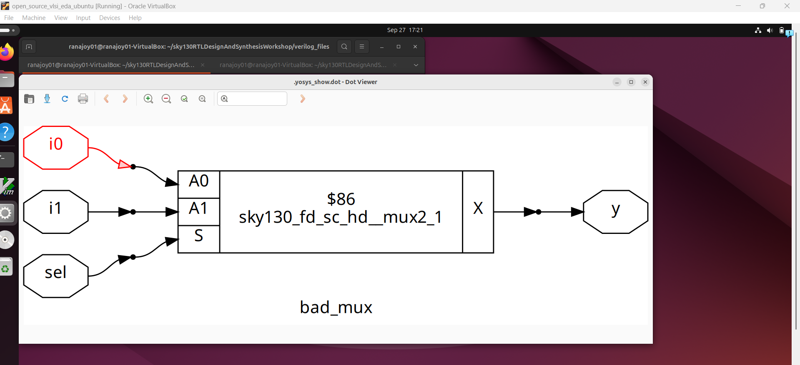

   Generate netlist-
   
   ```
   $ write_verilog -noattr bad_mux_net.v
   ```

   :bulb: It generated a `mux` cell.

   :zap: Gate level simulation of `bad_mux.v`
   
   
 Give the netlist `bad_mux_net.v` ,premitive ,standard cells and the testbench used for RTL design case `tb_bad_mux.v` to iverilog simulator-
    
   ```
   $ iverilog ../my_lib/verilog_model/primitives.v ../my_lib/verilog_model/sky130_fd_sc_hd.v bad_mux_net.v tb_bad_mux.v
   $ ./a.out
   $ gtkwave tb_bad_mux.vcd

   ```
   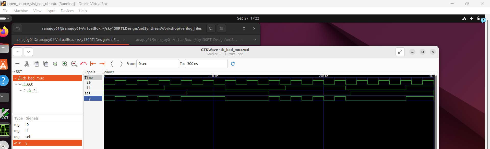

   :x: Here is `Synthesis-simulation` mismatch.

   :bulb: Due to `missing sensitivity list` issue in procedural block this occurs.
   
 ### :microscope: Lab-2:`Blocking statement issue` Functional simulation of RTL design and GLS simulation (Test design: `blocking_caveat.v`)
   
   :zap: Open the `blocking_caveat.v` file using text editor (For viewing the code not for simulation)-
     
   ```
   $ gvim blocking_caveat.v 
   ```
   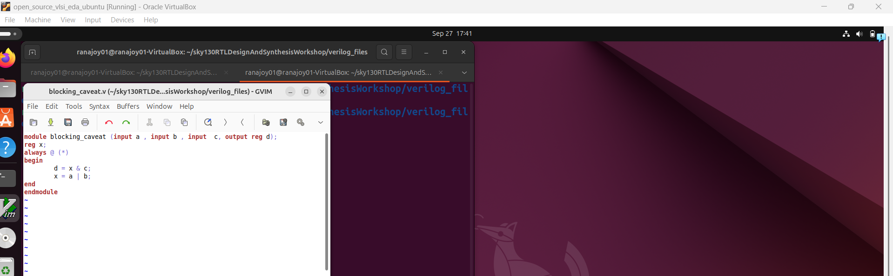

   :bulb: We want a combinational circuit (3 input ,1 output) with one `or` and one `and` gate.
   
   :zap: Simulate `blocking_caveat.v`-

   ```
   $ iverilog blocking_caveat.v tb_blocking_caveat.v
   $ ./a.out
   $ gtkwave tb_blocking_caveat.vcd

   ```

   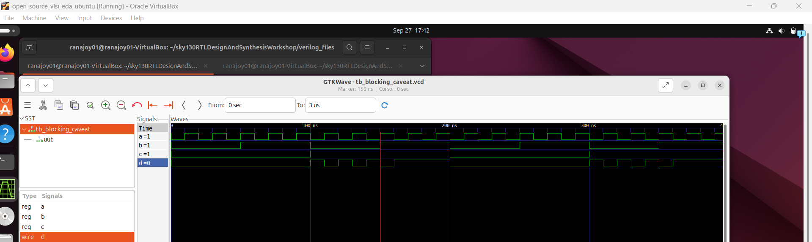

   :bulb: Functional simulation shows that it is not acting like intended.

   :zap: Synthesize `blocking_caveat.v` and generate netlist-
   
   ```
   $ yosys
   $ read_liberty -lib ../lib/sky130_fd_sc_hd__tt_025C_1v80.lib
   $ read_verilog blocking_caveat.v
   $ synth -top blocking_caveat
   $ abc -liberty ../lib/sky130_fd_sc_hd__tt_025C_1v80.lib
   $ show
   ```
   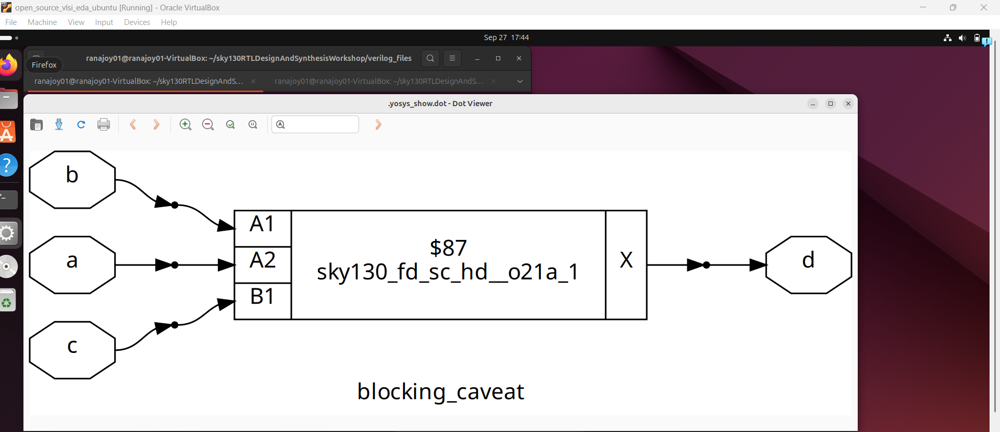

   Generate netlist-
   
   ```
   $ write_verilog -noattr blocking_caveat_net.v
   ```

   :bulb: It generated an `and` and an 'or' cell.

   :zap: Gate level simulation of `blocking_caveat.v`
   
   
 Give the netlist `blocking_caveat_net.v` ,premitive ,standard cells and the testbench used for RTL design case `tb_blocking_caveat.v` to iverilog simulator-
    
   ```
   $ iverilog ../my_lib/verilog_model/primitives.v ../my_lib/verilog_model/sky130_fd_sc_hd.v blocking_caveat_net.v tb_blocking_caveat.v
   $ ./a.out
   $ gtkwave tb_blocking_caveat.vcd

   ```
   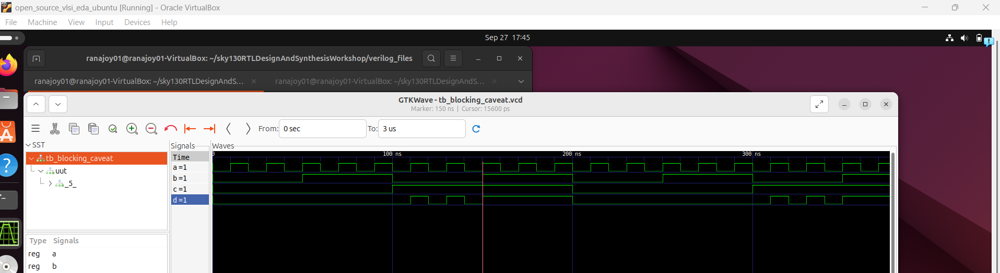

   :x: Here is no `Synthesis-simulation` mismatch.
   
   :bulb: This mismatch is caused by `blocking statement ordereing issue`.

   :warning: Use blocking assignment statements cautiously.
 
   <div align="center">:star::star::star::star::star::star:</div> 
   
## :trophy: Level Status: 

- All objectives completed.
- I have learned about Gate level simulation (GLS) and synthesis-simulation mismatch issues due to `missing sensitivity list` and `blocking statement ordering`.
- 🔓 Next level unlocked 🔜 [Level-5(Day-5): Optimization in synthesis (If,case,for,generate useage in verilog)](../Level_5/readme.md).


