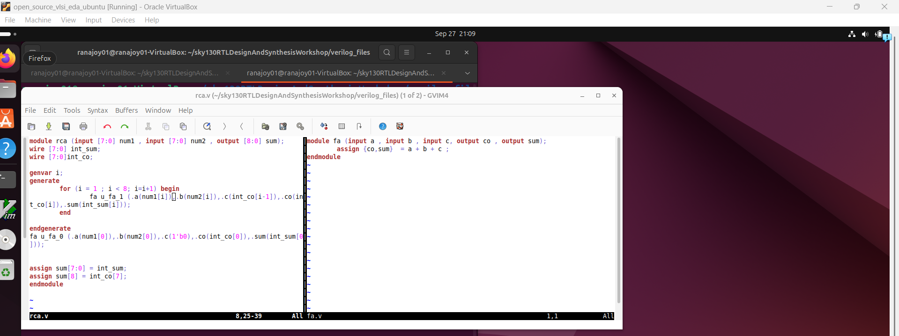
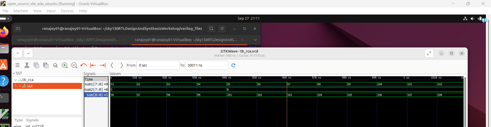
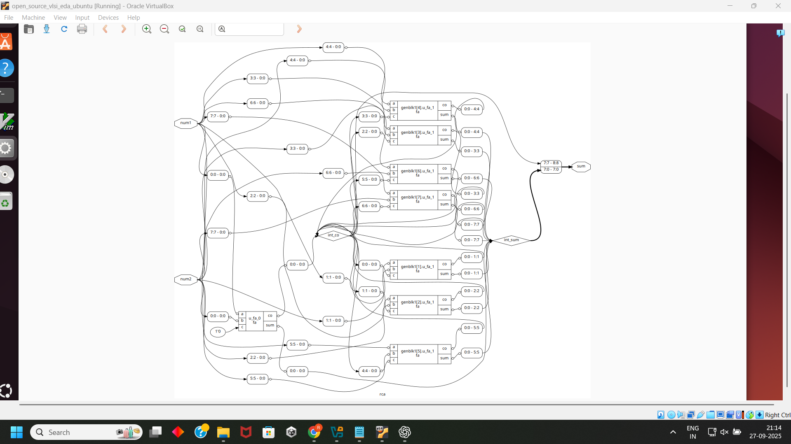
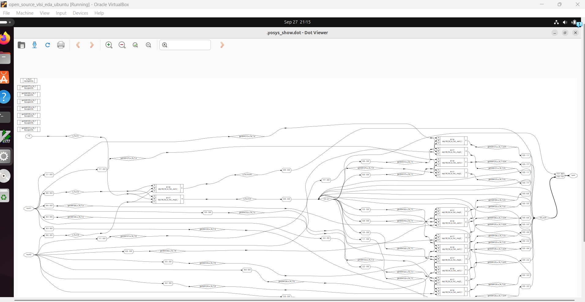

# Level-5(Day-5): Optimization in synthesis (If,case,for,generate useage in verilog)

## List of Objectives

 - :dart: <b>Practiccal Objective-1:</b> [Labs on incomplete `if`, 'case' statement and overlapping `case`](#dart-labs-on-incomplete-if-case-statement-and-overlapping-case
)
   - :microscope: <b>Lab-1:</b> [Incomplete `if` statement issue](#microscope-lab-1incomplete-if-statement-issue
)
   - :microscope: <b>Lab-2:</b>[Incomplete `case` statement issue, partial assignment overlapping `case` ](#microscope-lab-2incomplete-case-statement-issue-partial-assignment-overlapping-case
)

 - :dart: <b>Practiccal Objective-2:</b> [Labs on `for` loop and `for generate`](#dart-labs-on-for-loop-and-for-generate
)
   - :microscope: <b>Lab-3:</b> [Introduction to `for` loop](#microscope-lab-3-introduction-to-for-loop-test-design-mux_generatev-
)
   - :microscope: <b>Lab-4:</b>[Advantages of `for loop` over `case` statement](#microscope-lab-4-advantages-of-for-loop-over-case-statement-test-design-demux_generatev-and-demux_casev
)
   - :microscope: <b>Lab-5:</b>[Introduction to `for generate`](#microscope-lab-5-introduction-to-for-generate)
        
 <div align="center">:star::star::star::star::star::star:</div> 
 
## :dart: Labs on incomplete `if`, 'case' statement and overlapping `case`
 ### :microscope: Lab-1:Incomplete `if` statement issue

   :zap: Open the `incomp_if.v` file using text editor (For viewing the code not for simulation)-
     
   ```
   $ gvim incomp_if.v 
   ```
   

   :bulb: `Else` statement missing.
   
   :zap: Simulate `incomp_if.v`-

   ```
   $ iverilog incomp_if.v tb_incomp_if.v
   $ ./a.out
   $ gtkwave tb_incomp_if.vcd

   ```

   

  :bulb:  `Inferred latch` behaviour is observed due to incomplete `if` statement.

   :zap: Synthesize `incomp_if.v`-
   
   ```
   $ yosys
   $ read_liberty -lib ../lib/sky130_fd_sc_hd__tt_025C_1v80.lib
   $ read_verilog incomp_if.v
   $ synth -top incomp_if
   $ abc -liberty ../lib/sky130_fd_sc_hd__tt_025C_1v80.lib
   $ show
   ```
   

  :bulb: A `latch` is generated instead of a `mux`.
   
  ---

  :zap: Open the `incomp_if2.v` file using text editor (For viewing the code not for simulation)-
     
   ```
   $ gvim incomp_if2.v 
   ```
   

   :bulb: `If` and `else if` statement present but `else` statement missing.
   
   :zap: Simulate `incomp_if2.v`-

   ```
   $ iverilog incomp_if2.v tb_incomp_if2.v
   $ ./a.out
   $ gtkwave tb_incomp_if2.vcd

   ```

   

  :bulb:  `Inferred latch` behaviour is observed due to incomplete `if` statement.

   :zap: Synthesize `incomp_if2.v`-
   
   ```
   $ yosys
   $ read_liberty -lib ../lib/sky130_fd_sc_hd__tt_025C_1v80.lib
   $ read_verilog incomp_if2.v
   $ synth -top incomp_if2
   $ abc -liberty ../lib/sky130_fd_sc_hd__tt_025C_1v80.lib
   $ show
   ```
   

  :bulb: A `latch` is generated instead of a `mux`.
   
  
### :microscope: Lab-2:Incomplete `case` statement issue, partial assignment overlapping `case` 
   :zap: Open the `incomp_case.v` file using text editor (For viewing the code not for simulation)-
     
   ```
   $ gvim incomp_case.v 
   ```
   

   :bulb: All cases are not present.
   
   :zap: Simulate `incomp_case.v`-

   ```
   $ iverilog incomp_case.v tb_incomp_case.v
   $ ./a.out
   $ gtkwave tb_incomp_case.vcd

   ```

   

  :bulb:  `Inferred latch` behaviour is observed due to incomplete `case` statement.

   :zap: Synthesize `incomp_case.v`-
   
   ```
   $ yosys
   $ read_liberty -lib ../lib/sky130_fd_sc_hd__tt_025C_1v80.lib
   $ read_verilog incomp_case.v
   $ synth -top incomp_case
   $ abc -liberty ../lib/sky130_fd_sc_hd__tt_025C_1v80.lib
   $ show
   ```
   

  :bulb: Output is `latched` for unassigned `cases`.
  
  :warning: Complete all cases or use `default` for generating combinational circuit.

 ---

  :zap: Open the `partial_case_assign.v` file using text editor (For viewing the code not for simulation)-
     
   ```
   $ gvim partial_case_assign.v 
   ```
   

   :bulb: All cases are present but all variables are not assigned in all cases.

   :x: There were some errors in the verilog file `tb_partial_case_assign.v`-
   
     - module name 
     - 'uut' name
     - `i3` port is not present in `uut`.
     - `sel` is two bit line not 1 bit.
     - dumpfile name
     
   :white_check_box:  Fixed version of `tb_partial_case_assign.v`.

   


   :zap: Simulate `partial_case_assign.v`-

   ```
   $ iverilog partial_case_assign.v tb_partial_case_assign.v
   $ ./a.out
   $ gtkwave tb_partial_case_assign.vcd

   ```

   

  :bulb:  `Inferred latch` behaviour is observed due to partial assignment.

   :zap: Synthesize `partial_case_assign.v`-
   
   ```
   $ yosys
   $ read_liberty -lib ../lib/sky130_fd_sc_hd__tt_025C_1v80.lib
   $ read_verilog partial_case_assign.v
   $ synth -top partial_case_assign
   $ abc -liberty ../lib/sky130_fd_sc_hd__tt_025C_1v80.lib
   $ show
   ```
   

  :bulb: Output is `latched` for `partial assignment issues`.
  
  :warning: Same variables should be assigned in all cases.
  
  ---

  :zap: Open the `bad_case.v` file using text editor (For viewing the code not for simulation)-
     
   ```
   $ gvim bad_case.v 
   ```
   

   :bulb: All cases are present but overlapping of cases occur due to ambiguous.
   
   :zap: Simulate `bad_case.v`-

   ```
   $ iverilog bad_case.v tb_bad_case.v
   $ ./a.out
   $ gtkwave tb_bad_case.vcd

   ```

   

  :bulb:  Unintended situation occurs for ambiguous `cases`.

   :zap: Synthesize `bad_case.v` and generate netlist-
   
   ```
   $ yosys
   $ read_liberty -lib ../lib/sky130_fd_sc_hd__tt_025C_1v80.lib
   $ read_verilog bad_case.v
   $ synth -top bad_case
   $ abc -liberty ../lib/sky130_fd_sc_hd__tt_025C_1v80.lib
   $ show
   ```
   

   Generate netlist-
   
   ```
   $ write_verilog -noattr bad_case_net.v
   ```

   :zap: Gate level simulation of `bad_case.v`
   
   
 Give the netlist `bad_case.v` ,premitive ,standard cells and the testbench used for RTL design case `tb_bad_case.v` to iverilog simulator-
    
   ```
   $ iverilog ../my_lib/verilog_model/primitives.v ../my_lib/verilog_model/sky130_fd_sc_hd.v bad_case_net.v tb_bad_case.v
   $ ./a.out
   $ gtkwave tb_bad_case.vcd

   ```
   

   :x: Here is `Synthesis-simulation` mismatch.
   
   :bulb: This mismatch is caused by `overlapping case`.
 
   :bulb: Multiple cases can be evaluated, it is not like prioritize logic of `if` (only one condition evaluated for 'if').
  
   :warning: Overlapping cases should be avoided( as multiple cases are selected and unintended results are produced).
  

   
   <div align="center">:star::star::star::star::star::star:</div> 

## :dart: Labs on `for` loop and `for generate`
 ### :microscope: Lab-3: Introduction to `for` loop (Test design: `mux_generate.v` )
   :zap: Open the `mux_generate.v` file using text editor (For viewing the code not for simulation)-
     
   ```
   $ gvim mux_generate.v 
   ```
   

   :bulb: It resides inside the `always` procedural block.

   :bulb: It helps to efficiently write the code for large design with multiple instantiation of same block.
   
   
   :zap: Simulate `mux_generate.v`-

   ```
   $ iverilog mux_generate.v tb_mux_generate.v
   $ ./a.out
   $ gtkwave tb_mux_generate.vcd

   ```

   

  :bulb:  It functionally same as mux.


 ### :microscope: Lab-4: Advantages of `for loop` over `case` statement (Test design: `demux_generate.v` and `demux_case.v`)

   :zap: (Using `case`) Open the `demux_case.v` file using text editor (For viewing the code not for simulation)-
     
   ```
   $ gvim demux_case.v 
   ```
   
   
   :zap: Simulate `demux_case.v`-

   ```
   $ iverilog demux_case.v tb_demux_case.v
   $ ./a.out
   $ gtkwave tb_demux_case.vcd

   ```

   

  :bulb:  It is acting like a demux.

  ---

  :zap: (Using `for`) Open the `demux_generate.v` file using text editor (For viewing the code not for simulation)-
     
   ```
   $ gvim demux_generate.v 
   ```
   
   
   :zap: Simulate `demux_generate.v`-

   ```
   $ iverilog demux_generate.v tb_demux_generate.v
   $ ./a.out
   $ gtkwave tb_demux_generate.vcd

   ```

   

  :bulb:  It is acting like a demux.

  :bulb: Use `for` loop over `case` to design large Demux.

   ### :microscope: Lab-5: Introduction to `for generate`

   :bulb: Replicate hardware (submodule) instantiation into module inlarge design.

   :bulb: `for generate` is used outside the `always` procedural block.
   
   :zap: (Using `case`) Open the `rca.v` and `fa.v` files using text editor (For viewing the code not for simulation)-
     
   ```
   $ gvim rca.v fa.v -O
   ```
   
   
   :zap: Simulate `rca.v`-

   ```
   $ iverilog rca.v fa.v tb_rca.v
   $ ./a.out
   $ gtkwave tb_rca.vcd

   ```

   

  :bulb:  8 full adder (`fa.v`) are instantiated to design ripple cary adder (`rca.v`).

   :zap: Synthesize `rca.v` -
   
   ```
   $ yosys
   $ read_liberty -lib ../lib/sky130_fd_sc_hd__tt_025C_1v80.lib
   $ read_verilog rca.v fa.v
   $ synth -top rca
   $ abc -liberty ../lib/sky130_fd_sc_hd__tt_025C_1v80.lib
   $ show
   ```
   

   ```
   $ flatten
   $show
   ```
   

   <div align="center">:star::star::star::star::star::star:</div> 
   
## :trophy: Level Status: 

- All objectives completed.
- I have learned about `if`, `case`, `for` and `for generate` constructs and their application. 
- :white_check_mark: Map completed


